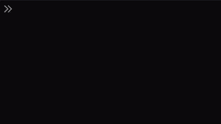

# UnyRandom [](https://www.npmjs.com/package/uny-random) [](LICENSE.md)

With UnyRandom, you easily can mimic the behaviour of the Unity Game Engine's PRNG [**UnityEngine.Random**](https://docs.unity3d.com/ScriptReference/Random.html) using JavaScript.


---

> This package is not sponsored by or affiliated with Unity Technologies or its affiliates. "Unity" is a trademark or registered trademark of Unity Technologies or its affiliates in the U.S. and elsewhere. All the code in this package is only made to mirror the behaviour of the original PRNG and is not to be seen as a representation of the original source code owned by Unity Technologies.

---

## How to install

UnyRandom is a [Node.js](https://nodejs.org/en/) module available through the
[npm registry](https://www.npmjs.com/), available for installation via any popular JavaScript package manager.

To add the module to a Node.js project, make sure you have at least Node.js v13 or higher installed and add the package via the appropriate command:

```sh
npm install uny-random #or any other package manager you like
```

The package can then be added to your project via ES6 import:

```JavaScript
import unyRandom from 'UnyRandom'; // For a static version of the PRNG
// or
import { UnyRandom } from 'UnyRandom'; // To make the UnyRandom parent class available
```

The randomiser can also be added directly to a website (ES5 compatible):

```html
<script type="text/javascript" src="https://cdn.jsdelivr.net/npm/uny-random@1.6.0/dist/uny-random.min.js"></script>
```

and will globaly available as an instance called `unyRandom`:


## How to use

The class is made to replicate behaviour of the [UnityEngine.Random](https://docs.unity3d.com/ScriptReference/Random.html)
